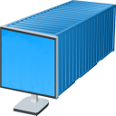

# desktainer



[](https://hub.docker.com/r/dmotte/desktainer)
[](https://hub.docker.com/r/dmotte/desktainer)

:computer: Remote **desk**top in a cont**ainer**.

> :package: This image is also on **Docker Hub** as [`dmotte/desktainer`](https://hub.docker.com/r/dmotte/desktainer) and runs on **several architectures** (e.g. amd64, arm64, ...). To see the full list of supported platforms, please refer to the `.github/workflows/docker.yml` file. If you need an architecture which is currently unsupported, feel free to open an issue.

Thanks to [fcwu/docker-ubuntu-vnc-desktop](https://github.com/fcwu/docker-ubuntu-vnc-desktop) and [soffchen/tiny-remote-desktop](https://github.com/soffchen/tiny-remote-desktop) for the inspiration.

## Usage

The simplest way to try this image is:

```bash
docker run -it --rm -p 6901:6901 dmotte/desktainer
```

Then head over to http://localhost:6901/ to access the remote desktop.


For a more complex example, refer to the `docker-compose.yml` file.

TODO you can make your own Dockerfile starting from this and/or mount your own supervisord file. See example of how to extend

TODO this image is not meant to be run with the --user docker option

### Environment variables

List of supported **environment variables**:

Variable       | Required               | Description
-------------- | ---------------------- | ---
`RESOLUTION`   | No (default: 1280x720) | Screen resolution
`USER`         | No (default: debian)   | Name of the custom user. If set to `root`, no custom user will be created and the main user will be root
`PASSWORD`     | No (default: `debian`) | Password of the custom user (if `USER != root`)
`VNC_PASSWORD` | No (default: `debian`) | Password for the VNC server
`VNC_PORT`     | No (default: 5901)     | TCP port of the VNC server
`NOVNC_PORT`   | No (default: 6901)     | TCP port of the noVNC webserver

## Development

If you want to contribute to this project, the first thing you have to do is to **clone this repository** on your local machine:

```bash
git clone https://github.com/dmotte/desktainer.git
```

Then you just have to run this command:

```bash
docker-compose up --build
```

This will automatically **build the Docker image** using the `docker-build` directory as build context and then the **Docker-Compose stack** will be started.

If you prefer to run the stack in daemon (detached) mode:

```bash
docker-compose up -d
```

In this case, you can view the logs using the `docker-compose logs` command:

```bash
docker-compose logs -ft
```
