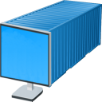
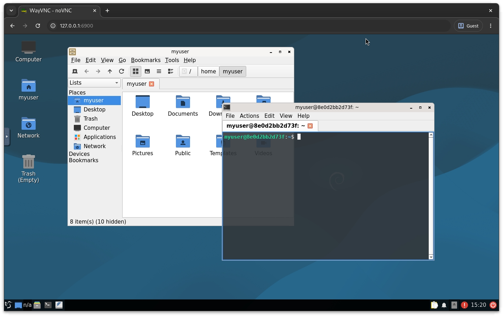

# desktainer



[](https://github.com/dmotte/desktainer/actions)
[](https://hub.docker.com/r/dmotte/desktainer)

:computer: Remote **desk**top in a con**tainer**.

> :package: This image is also on **Docker Hub** as [`dmotte/desktainer`](https://hub.docker.com/r/dmotte/desktainer) and runs on **several architectures** (e.g. amd64, arm64, ...). To see the full list of supported platforms, please refer to the [`.github/workflows/main.yml`](.github/workflows/main.yml) file. If you need an architecture that is currently unsupported, feel free to open an issue.

Thanks to [fcwu/docker-ubuntu-vnc-desktop](https://github.com/fcwu/docker-ubuntu-vnc-desktop) and [soffchen/tiny-remote-desktop](https://github.com/soffchen/tiny-remote-desktop) for the inspiration.

## Simple usage

The simplest way to try this image is:

```bash
docker run -it --rm -p6900:6900 dmotte/desktainer
```

> **Note**: since some GUI applications may have issues with Docker's default _seccomp_ profile, you may need to use `--security-opt seccomp=unconfined` TODO is this still needed with Wayland? Check and, if not, remove it

Then head over to http://localhost:6900/ to access the remote desktop.



## Standard usage

The [`docker-compose.yml`](docker-compose.yml) file contains a complete usage example for this image. Feel free to simplify it and adapt it to your needs. Unless you want to build the image from scratch, comment out the `build: build` line to use the pre-built one from _Docker Hub_ instead.

To start the Docker-Compose stack in daemon (detached) mode:

```bash
docker-compose up -d
```

Then you can view the logs using this command:

```bash
docker-compose logs -ft
```

## Tips

- :bulb: If you want to **change the resolution** while the container is running, you can use the `xrandr --fb 1024x768` command. The new resolution cannot be larger than the one specified in the `RESOLUTION` environment variable though
- :bulb: If you need to, you can extend this project by making your own `Dockerfile` starting from this image (i.e. `FROM docker.io/dmotte/desktainer:latest`) and/or mount custom _supervisor_ configuration files. See the [`example`](example) folder for an example of how to do it
- :bulb: If you need to run things on desktop environment startup, you can create launcher files in the `/etc/xdg/autostart` or the `~/.config/autostart` directory

## Environment variables

List of supported **environment variables**:

| Variable              | Required                 | Description                                                                                     |
| --------------------- | ------------------------ | ----------------------------------------------------------------------------------------------- |
| `RESOLUTION`          | No (default: 1920x1080)  | Screen resolution                                                                               |
| `MAINUSER_NAME`       | No (default: mainuser)   | Name of the main user. If set to `root`, no user will be created and the main user will be root |
| `MAINUSER_PASS`       | No (default: `mainuser`) | Password of the main user (if `MAINUSER_NAME != root`)                                          |
| `MAINUSER_NOPASSWORD` | No (default: `false`)    | Whether or not the main user should be allowed to `sudo` without password                       |
| `VNC_PASS`            | No (default: none)       | Password for the VNC server                                                                     |
| `VNC_PORT`            | No (default: 5900)       | TCP port of the VNC server                                                                      |
| `NOVNC_PORT`          | No (default: 6900)       | TCP port of the noVNC webserver                                                                 |

## Development

If you want to contribute to this project, you can use the following one-liner to **rebuild the image** and bring up the **Docker-Compose stack** every time you make a change to the code:

```bash
docker-compose down && docker-compose up --build
```

> **Note**: I know that this Docker image has many **layers**, but this shouldn't be a problem in most cases. If you want to reduce its number of layers, there are several techniques out there, e.g. see [this](https://stackoverflow.com/questions/39695031/how-make-docker-layer-to-single-layer)

## TODO

Remember to update the screenshot after the rework is completed.

Note in the README, I guess in the usage example: This Docker image runs [userngo](https://github.com/dmotte/misc/tree/main/scripts/userngo) at startup. See https://github.com/dmotte/misc/tree/main/scripts/userngo#examples.

Draft of the new setup:

```bash
websockify --web=/usr/share/novnc 6900 127.0.0.1:5900

# Workaround: only if the DESKTAINER_DISABLE_MINIMIZE env var is set to "true" and the file doesn't exist yet:
install -Tvm644 /dev/stdin ~/.config/labwc/rc.xml << 'EOF'
<?xml version="1.0"?>
<labwc_config>
  <mouse>
    <default />

    <context name="Iconify">
      <mousebind button="Left" action="Click">
        <action name="None" />
      </mousebind>
    </context>
  </mouse>
</labwc_config>
EOF

# Known issue: the Task Manager panel doesn't show any window. But LXQt's Wayland support is still experimental in Debian 13 (trixie), and it will be more robust in Debian 14 (forky). For now, we can use Alt+Tab to cycle through open windows
SHELL=/bin/bash WLR_BACKENDS=headless WLR_RENDERER=pixman QT_QPA_PLATFORM=wayland dbus-run-session -- labwc -S'startlxqt'
# Support env var DESKTAINER_LABWC_VERBOSE to add the "-V" (verbose) flag to labwc

# Warning: when running as root, "enable_pam=true" makes wayvnc accept any existing user as a valid login
printf '%s\n' enable_auth=true relax_encryption=true enable_pam=true |
    install -DTvm644 /dev/stdin ~/.config/wayvnc/config

# Note: wayvnc creates the unix domain socket "$XDG_RUNTIME_DIR/wayvncctl" to make the wayvncctl CLI tool work
XDG_RUNTIME_DIR=/tmp/runtime-root WAYLAND_DISPLAY=wayland-0 wayvnc -D 0.0.0.0
# Support DESKTAINER_PORT_VNC=unix to run it like "wayvnc -u"

XDG_RUNTIME_DIR=/tmp/runtime-root wayvncctl -w attach "$WAYLAND_DISPLAY"

dconf write /org/gnome/desktop/interface/gtk-theme "'Adwaita-dark'"
```
